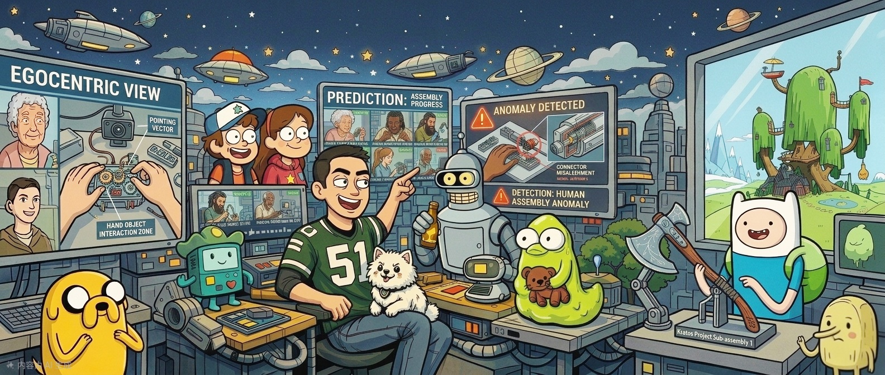

  

<h1 align="center">Di Wen</h1>

  PhD Student @ Karlsruhe Institute of Technology (KIT)

  Fine-Grained Human Action Understanding • Video Understanding • Anticipation • Anomaly Detection

  
  
  
  

## Research Interests

- Fine-grained Human Action Understanding
- Video Understanding
- Action Anticipation
- Anomaly Detection
- Industrial AI

## GitHub Stats

  

## Most Used Languages

  

## GitHub Streak

  

